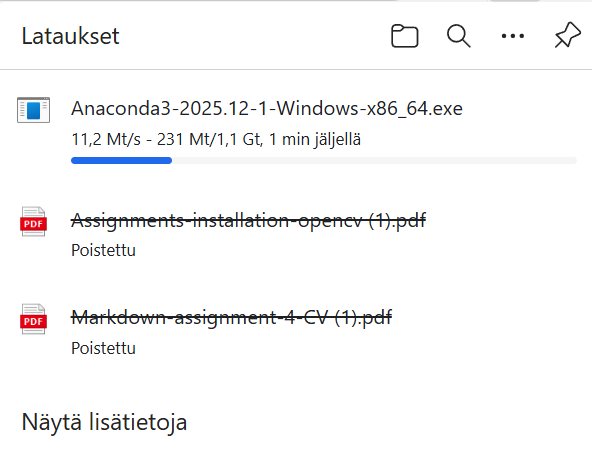
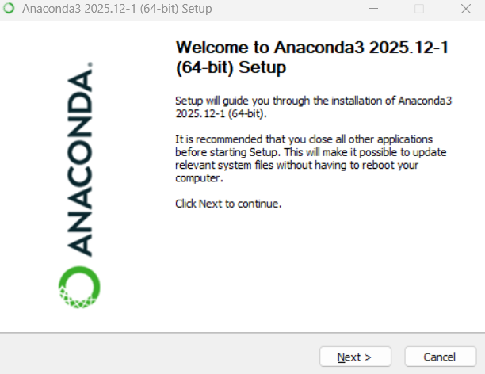
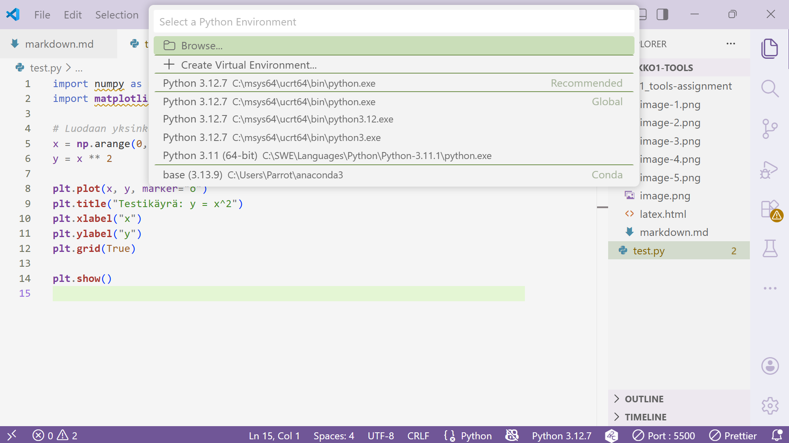
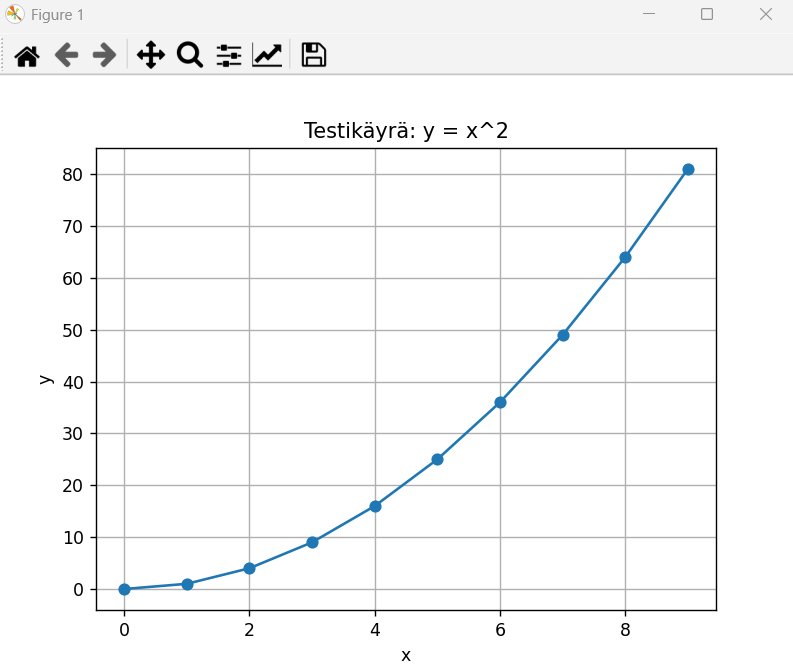

# Object Detection Tools Assignment

The first part of this tools assignment is about learning Markdown and Latex.

## Basic Syntax of Markdown

### Images


### Tables

<table>
    <tr>
        <th>Species</th>
        <th>Color</th>
        <th>Size</th>
        <th>Sound Level</th>
    </tr>
    <tr>
        <td>Blue Macaw</td>
        <td>Blue-Black-Yellow</td>
        <td>Large</td>
        <td>6/10</td>
    </tr>
    <tr>
        <td>Sun Conure</td>
        <td>Orange-Yellow-Green</td>
        <td>Medium</td>
        <td>10/10</td>
    </tr>
    <tr>
        <td>Budgie</td>
        <td>Variant, almost any color</td>
        <td>Small</td>
        <td>2/10</td>
    </tr>
</table>

### Code Blocks

```
def printParrots(arrayOfParrots):
    for parrot in arrayOfParrots:
        print(parrot)
```

### Italic and Bold text

_Parrots_ are great pets. But they do require **A Lot Of Space**.
One reason for this is they are very active, and social. They also need to be able to **fly** to maintain their _natural health_. They often need other birds as well to keep company.

### Links

A useful guide to keeping parrots: [Parakeets And Parrots](https://parakeetsandparrots.com/)

### Blockquotes

> Parrots don't roll dice. - Einstein

### Ordered and unordered lists

Important things to keep in mind when considering buying a parrot:

1.  Cleaning is a lot of work with parrots. They have a lot of dust and other dirt to clean.
2.  The natural way of birds to communicate is via different sounds, so if one wants a silent pet, parrot is not ideal.
3.  They need a lot company so in addition to having large enclosure and toys, owner should spend time with them.

Other things to mention yet:

-   Money. They are costly to keep, and medical bills can be high.
-   Biting habbit. Parrot's may bite, and they do not learn to not bite like dogs by getting negative feedback from owner. Instead they learn to not bite by owner staying calm and not responding to bites anyhow.

## Mathematical formulas in Latex and Markdown

There are many possible solutions to showing mathematical formulas in Markdown. Personally, I want the formulas to be visible not just on my pc (e.g via installing some preview extension) but also via GitHub. Therefore, what I do to show mathematical formulas on markdown, is:

1. Go to katex.org, install the application: [katex.org](https://katex.org/). How i installed the application, is i took the html code they have on their website, and copy pasted it on a local latex.html file. And then opened the html file on liveserver. Here is code and screenshots about the procedure:

```
<!DOCTYPE html>
<html>
    <head>
        <meta charset="utf-8" />
        <link
            rel="stylesheet"
            href="https://cdn.jsdelivr.net/npm/katex@0.16.0/dist/katex.min.css"
        />
        <script
            defer
            src="https://cdn.jsdelivr.net/npm/katex@0.16.0/dist/katex.min.js"
        ></script>
        <script
            defer
            src="https://cdn.jsdelivr.net/npm/katex@0.16.0/dist/contrib/auto-render.min.js"
            onload="renderMathInElement(document.body);"
        ></script>
    </head>
    <body>
        <p>Tässä on kaava:</p>
        <p>\( \sigma = \sqrt{\frac{1}{N}\sum_{i=1}^N (x_i - \mu)^2} \)</p>
    </body>
</html>
```


2. Use the katex website defined above to make any mathematical formula with Latex. Take screenshots of any formula u need after u created it with latex syntax on the p-tag:
3. If need for using latex is higher than very occasionally, consider installing some real application on pc, or registering on for example overleaf.com website.

### Final version of mathematical formulas

So here is the final html code, that contains all math formulas asked in the assignment:

```
<!DOCTYPE html>
<html>
    <head>
        <meta charset="utf-8" />
        <link
            rel="stylesheet"
            href="https://cdn.jsdelivr.net/npm/katex@0.16.0/dist/katex.min.css"
        />
        <script
            defer
            src="https://cdn.jsdelivr.net/npm/katex@0.16.0/dist/katex.min.js"
        ></script>
        <script
            defer
            src="https://cdn.jsdelivr.net/npm/katex@0.16.0/dist/contrib/auto-render.min.js"
            onload="renderMathInElement(document.body);"
        ></script>
    </head>
    <body>
        <p>All formulas:</p>

        <p>\( \sigma = \sqrt{\frac{1}{N}\sum_{i=1}^N (x_i - \mu)^2} \)</p>

        <p>\( h[m,n] = \sum_{k,i}f[k.l]I[m + k,n + l] \)</p>

        <p>\( L(W) = (1/N) \sum_{i=1}^{N} Li(f(x_i, W), yi) \)</p>

        <p>
            \( \frac{df}{dx} = \lim_{\Delta x \to 0} \frac{f(x) - f(x-\Delta x)}{\Delta x}
            = f'(x) = f_x \)
        </p>

        <p>
            \( J_f(\mathbf{x}) = \begin{pmatrix} \frac{\partial f_1}{\partial x_1} &
            \cdots & \frac{\partial f_1}{\partial x_n} \\ \frac{\partial f_2}{\partial
            x_1} & \cdots & \frac{\partial f_2}{\partial x_n} \\ \vdots & \ddots & \vdots
            \\ \frac{\partial f_m}{\partial x_1} & \cdots & \frac{\partial f_m}{\partial
            x_n} \end{pmatrix} \)
        </p>

        <p>
            \( \text{Let: } \begin{pmatrix} 1 & 4 \\ 2 & 5 \\ 3 & 6 \end{pmatrix} \cdot
            \begin{pmatrix} 2 && 0 \\ 3 && 1 \end{pmatrix} = \begin{pmatrix} (1 * 2 + 3 *
            4) && (1 * 0 + 4 * 1) \\ (2 * 2 + 5 * 3) && (2 * 0 + 5 * 1) \\ (3 * 2 + 6 * 3)
            && (3 * 0 + 6 * 1) \end{pmatrix} = \begin{pmatrix} 14 && 4 \\ 19 && 5 \\ 24 &&
            6 \end{pmatrix} \)
        </p>
    </body>
</html>
```

And here is a screenshot of them:


## Installing Anaconda python environment

Anaconda is probably easier alternative to handling python virtuan environment compared to manually installing every single python library and their dependency. At least according to my own experience Anaconda ensures a smooth developing experience.

So, the first step is to go into their [website](https://www.anaconda.com/download/success) and downloading the Anaconda. Select the Large anaconda, not miniconda.



Follow the installation software with next settings:


-

After installation is completed, there should emerge "Anaconda Navigator". Which is a graphic software, that gives some control over the Anaconda environment. But what is even more important is that one can select in VS Code to run a code via Anaconda. So, first i make a simple test.py code:

```
import numpy as np
import matplotlib.pyplot as plt

# Luodaan yksinkertaista dataa
x = np.arange(0, 10, 1)      # 0,1,2,...,9
y = x ** 2                   # x^2

plt.plot(x, y, marker="o")
plt.title("Testikäyrä: y = x^2")
plt.xlabel("x")
plt.ylabel("y")
plt.grid(True)

plt.show()
```

And then i try to run it with Anaconda by selecting from vscode bottom panel the correct python interpreter:



I was able to get the graph of matplytlob work, so anaconda should work well:



But for this course we need other libraries, so i make a new conda venv, and install there the needed libraries:

-   opencv,
-   numpy,
-   panads,
-   matplotlib,
-   scipy,
-   scikit-learn,
-   jupyter,
-   tensorflow,
-   ipykernel,
-   pytorch,
-   torchvision

So, open the Anaconda Prompt, and create a new venv, and install there all the needed libraries:

-   conda create -n ANACONDA_NEURAL_NETWORKS_ENV python=3.11 -y
-   conda activate ANACONDA_NEURAL_NETWORKS_ENV
-   conda install -c conda-forge numpy pandas matplotlib scipy scikit-learn jupyter ipykernel opencv -y
-   conda install pytorch torchvision torchaudio cpuonly -c pytorch -y
-   python -c "import numpy, pandas, matplotlib, scipy, sklearn, cv2, tensorflow, torch; print('Kaikki kirjastot toimii!')"
-   conda install numpy=1.26 -y
-   python -c "import numpy, pandas, matplotlib, scipy, sklearn, cv2, tensorflow, torch; print('Kaikki kirjastot toimii!')"


Ja kaikki toimii, eli nyt ympäristön pitäisi olla kunnossa! Senkin voi valita python tiedostoa ajettaessa alhaalta.

Kaikki asennetut kirjastot:

```
(ANACONDA_NEURAL_NETWORKS_ENV) C:\Users\Parrot>conda list
# packages in environment at C:\Users\Parrot\anaconda3\envs\ANACONDA_NEURAL_NETWORKS_ENV:
#
# Name                           Version                Build                  Channel
_libavif_api                     1.3.0                  h57928b3_2             conda-forge
absl-py                          2.3.1                  pyhd8ed1ab_0           conda-forge
anyio                            4.12.1                 pyhcf101f3_0           conda-forge
aom                              3.9.1                  he0c23c2_0             conda-forge
argon2-cffi                      25.1.0                 pyhd8ed1ab_0           conda-forge
argon2-cffi-bindings             25.1.0                 py311h3485c13_2        conda-forge
arrow                            1.4.0                  pyhcf101f3_0           conda-forge
asttokens                        3.0.1                  pyhd8ed1ab_0           conda-forge
astunparse                       1.6.3                  pyhd8ed1ab_3           conda-forge
async-lru                        2.0.5                  pyh29332c3_0           conda-forge
attrs                            25.4.0                 pyhcf101f3_1           conda-forge
babel                            2.17.0                 pyhd8ed1ab_0           conda-forge
backports.zstd                   1.3.0                  py311h71c1bcc_0        conda-forge
beautifulsoup4                   4.14.3                 pyha770c72_0           conda-forge
blas                             1.0                    mkl
bleach                           6.3.0                  pyhcf101f3_0           conda-forge
bleach-with-css                  6.3.0                  h5f6438b_0             conda-forge
brotli                           1.2.0                  h2d644bc_1             conda-forge
brotli-bin                       1.2.0                  hfd05255_1             conda-forge
brotli-python                    1.2.0                  py311hc5da9e4_1        conda-forge
bzip2                            1.0.8                  h2bbff1b_6
c-ares                           1.34.6                 hfd05255_0             conda-forge
ca-certificates                  2026.1.4               h4c7d964_0             conda-forge
cached-property                  1.5.2                  hd8ed1ab_1             conda-forge
cached_property                  1.5.2                  pyha770c72_1           conda-forge
cairo                            1.18.0                 h91e5215_2             conda-forge
certifi                          2026.1.4               pyhd8ed1ab_0           conda-forge
cffi                             2.0.0                  py311h3485c13_1        conda-forge
charset-normalizer               3.4.4                  pyhd8ed1ab_0           conda-forge
colorama                         0.4.6                  pyhd8ed1ab_1           conda-forge
comm                             0.2.3                  pyhe01879c_0           conda-forge
contourpy                        1.3.3                  py311h3fd045d_3        conda-forge
cpuonly                          2.0                    0                      pytorch
cycler                           0.12.1                 pyhcf101f3_2           conda-forge
dav1d                            1.2.1                  hcfcfb64_0             conda-forge
debugpy                          1.8.19                 py311h5dfdfe8_0        conda-forge
decorator                        5.2.1                  pyhd8ed1ab_0           conda-forge
defusedxml                       0.7.1                  pyhd8ed1ab_0           conda-forge
eigen                            3.4.0                  h477610d_1             conda-forge
exceptiongroup                   1.3.1                  pyhd8ed1ab_0           conda-forge
executing                        2.2.1                  pyhd8ed1ab_0           conda-forge
expat                            2.7.3                  h885b0b7_4
ffmpeg                           6.1.1                  haa678a1_5
filelock                         3.20.0                 py311haa95532_0
flatbuffers                      24.3.25                h63175ca_0             conda-forge
font-ttf-dejavu-sans-mono        2.37                   hab24e00_0             conda-forge
font-ttf-inconsolata             3.000                  h77eed37_0             conda-forge
font-ttf-source-code-pro         2.038                  h77eed37_0             conda-forge
font-ttf-ubuntu                  0.83                   h77eed37_3             conda-forge
fontconfig                       2.15.0                 h765892d_1             conda-forge
fonts-conda-ecosystem            1                      0                      conda-forge
fonts-conda-forge                1                      hc364b38_1             conda-forge
fonttools                        4.61.1                 py311h3f79411_0        conda-forge
fqdn                             1.5.1                  pyhd8ed1ab_1           conda-forge
freeglut                         3.8.0                  hfcef157_0
freetype                         2.14.1                 h57928b3_0             conda-forge
fribidi                          1.0.16                 hfd05255_0             conda-forge
gast                             0.7.0                  pyhd8ed1ab_0           conda-forge
gflags                           2.2.2                  he0c23c2_1005          conda-forge
giflib                           5.2.2                  h64bf75a_0             conda-forge
glog                             0.5.0                  h4797de2_0             conda-forge
gmp                              6.3.0                  h537511b_0
gmpy2                            2.2.2                  py311h8598115_0
google-pasta                     0.2.0                  pyhd8ed1ab_2           conda-forge
graphite2                        1.3.14                 hac47afa_2             conda-forge
grpcio                           1.71.0                 py311h05171df_0        conda-forge
gst-plugins-base                 1.24.12                h91a6125_1
gstreamer                        1.24.12                hfb93a4f_1
gstreamer-orc                    0.4.42                 h6c41571_0             conda-forge
h11                              0.16.0                 pyhcf101f3_1           conda-forge
h2                               4.3.0                  pyhcf101f3_0           conda-forge
h5py                             3.15.1                 py311he283ef2_1
harfbuzz                         10.2.0                 he2f9f60_1
hdf5                             1.14.5                 ha36df97_2
hpack                            4.1.0                  pyhd8ed1ab_0           conda-forge
httpcore                         1.0.9                  pyh29332c3_0           conda-forge
httpx                            0.28.1                 pyhd8ed1ab_0           conda-forge
hyperframe                       6.1.0                  pyhd8ed1ab_0           conda-forge
icc_rt                           2022.1.0               h6049295_2
icu                              73.2                   h63175ca_0             conda-forge
idna                             3.11                   pyhd8ed1ab_0           conda-forge
impi_rt                          2021.16.0              h57928b3_439           conda-forge
importlib-metadata               8.7.0                  pyhe01879c_1           conda-forge
importlib_resources              6.5.2                  pyhd8ed1ab_0           conda-forge
intel-openmp                     2025.0.0               haa95532_1164
ipykernel                        7.1.0                  pyh6dadd2b_0           conda-forge
ipython                          9.9.0                  pyhe2676ad_0           conda-forge
ipython_pygments_lexers          1.1.1                  pyhd8ed1ab_0           conda-forge
ipywidgets                       8.1.8                  pyhd8ed1ab_0           conda-forge
isoduration                      20.11.0                pyhd8ed1ab_1           conda-forge
jedi                             0.19.2                 pyhd8ed1ab_1           conda-forge
jinja2                           3.1.6                  pyhcf101f3_1           conda-forge
joblib                           1.5.3                  pyhd8ed1ab_0           conda-forge
jpeg                             9f                     ha349fce_0
json5                            0.13.0                 pyhd8ed1ab_0           conda-forge
jsonpointer                      3.0.0                  pyhcf101f3_3           conda-forge
jsonschema                       4.26.0                 pyhcf101f3_0           conda-forge
jsonschema-specifications        2025.9.1               pyhcf101f3_0           conda-forge
jsonschema-with-format-nongpl    4.26.0                 hcf101f3_0             conda-forge
jupyter                          1.1.1                  pyhd8ed1ab_1           conda-forge
jupyter-lsp                      2.3.0                  pyhcf101f3_0           conda-forge
jupyter_client                   8.8.0                  pyhcf101f3_0           conda-forge
jupyter_console                  6.6.3                  pyhd8ed1ab_1           conda-forge
jupyter_core                     5.9.1                  pyh6dadd2b_0           conda-forge
jupyter_events                   0.12.0                 pyh29332c3_0           conda-forge
jupyter_server                   2.17.0                 pyhcf101f3_0           conda-forge
jupyter_server_terminals         0.5.3                  pyhd8ed1ab_1           conda-forge
jupyterlab                       4.5.2                  pyhd8ed1ab_0           conda-forge
jupyterlab_pygments              0.3.0                  pyhd8ed1ab_2           conda-forge
jupyterlab_server                2.28.0                 pyhcf101f3_0           conda-forge
jupyterlab_widgets               3.0.16                 pyhcf101f3_1           conda-forge
keras                            3.11.2                 pyh753f3f9_0           conda-forge
kiwisolver                       1.4.9                  py311h275cad7_2        conda-forge
krb5                             1.21.3                 hdf4eb48_0             conda-forge
lark                             1.3.1                  pyhd8ed1ab_0           conda-forge
lcms2                            2.17                   h3732fa5_0
lerc                             4.0.0                  h6470a55_1             conda-forge
libabseil                        20250127.0             cxx17_h4eb7d71_0       conda-forge
libavif                          1.3.0                  he916da2_2             conda-forge
libavif16                        1.3.0                  he916da2_2             conda-forge
libbrotlicommon                  1.2.0                  hfd05255_1             conda-forge
libbrotlidec                     1.2.0                  hfd05255_1             conda-forge
libbrotlienc                     1.2.0                  hfd05255_1             conda-forge
libclang13                       21.1.8                 default_ha2db4b5_1     conda-forge
libcurl                          8.18.0                 h43ecb02_0             conda-forge
libdeflate                       1.22                   h2466b09_0             conda-forge
libevent                         2.1.12                 h3671451_1             conda-forge
libexpat                         2.7.3                  h885b0b7_4
libffi                           3.4.4                  hd77b12b_1
libfreetype                      2.14.1                 h57928b3_0             conda-forge
libfreetype6                     2.14.1                 hdbac1cb_0             conda-forge
libglib                          2.84.4                 hfaec014_0
libgrpc                          1.71.0                 h35301be_0             conda-forge
libhwloc                         2.12.1                 default_h88281d1_1000  conda-forge
libiconv                         1.18                   hc1393d2_2             conda-forge
libjpeg-turbo                    2.0.0                  h196d8e1_0
libkrb5                          1.21.3                 h885b0b7_4
libogg                           1.3.5                  h2466b09_1             conda-forge
libopenjpeg                      2.5.4                  h02ab6af_1
libpng                           1.6.54                 h7351971_0             conda-forge
libpq                            17.6                   h652a1e2_0
libprotobuf                      5.29.3                 he9d8c4a_0             conda-forge
libre2-11                        2024.07.02             hd248061_3             conda-forge
libsodium                        1.0.20                 hc70643c_0             conda-forge
libssh2                          1.11.1                 h9aa295b_0             conda-forge
libtheora                        1.2.0                  habf309d_1
libtiff                          4.7.1                  h3a18249_0
libuv                            1.48.0                 h827c3e9_0
libvorbis                        1.3.7                  h5112557_2             conda-forge
libwebp-base                     1.6.0                  h4d5522a_0             conda-forge
libwinpthread                    12.0.0.r4.gg4f2fc60ca  h57928b3_10            conda-forge
libxml2                          2.13.9                 h741aa76_0             conda-forge
libxslt                          1.1.43                 h25c3957_0             conda-forge
libzlib                          1.3.1                  h02ab6af_0
llvm-openmp                      20.1.8                 h29ce207_0
markdown                         3.10                   pyhcf101f3_1           conda-forge
markdown-it-py                   4.0.0                  pyhd8ed1ab_0           conda-forge
markupsafe                       3.0.3                  py311h3f79411_0        conda-forge
matplotlib                       3.10.8                 py311h1ea47a8_0        conda-forge
matplotlib-base                  3.10.8                 py311h1675fdf_0        conda-forge
matplotlib-inline                0.2.1                  pyhd8ed1ab_0           conda-forge
mdurl                            0.1.2                  pyhd8ed1ab_1           conda-forge
mistune                          3.2.0                  pyhcf101f3_0           conda-forge
mkl                              2025.0.0               h5da7b33_930
mkl-service                      2.5.2                  py311h0b37514_0
mkl_fft                          2.1.1                  py311h300f80d_0
mkl_random                       1.3.0                  py311ha5e6156_0
ml_dtypes                        0.5.4                  np2py311hf2e69b3_0     conda-forge
mpc                              1.3.1                  h827c3e9_0
mpfr                             4.2.1                  h56c3642_0
mpi                              1.0                    impi                   conda-forge
mpi4py                           4.1.1                  py311h58c7454_102      conda-forge
mpmath                           1.3.0                  py311haa95532_0
munkres                          1.1.4                  pyhd8ed1ab_1           conda-forge
mysql-common                     9.3.0                  h2224204_0             conda-forge
mysql-libs                       9.3.0                  h809f9c2_0             conda-forge
namex                            0.1.0                  pyhd8ed1ab_0           conda-forge
nbclient                         0.10.4                 pyhd8ed1ab_0           conda-forge
nbconvert-core                   7.16.6                 pyhcf101f3_1           conda-forge
nbformat                         5.10.4                 pyhd8ed1ab_1           conda-forge
nest-asyncio                     1.6.0                  pyhd8ed1ab_1           conda-forge
networkx                         3.6.1                  py311haa95532_0
notebook                         7.5.2                  pyhcf101f3_0           conda-forge
notebook-shim                    0.2.4                  pyhd8ed1ab_1           conda-forge
numpy                            1.26.4                 py311h12f7302_1
numpy-base                       1.26.4                 py311he4e2855_1
opencv                           4.12.0                 py311h6fcf9f4_0
openjpeg                         2.5.4                  h24db6dd_0             conda-forge
openssl                          3.6.0                  h725018a_0             conda-forge
opt_einsum                       3.4.0                  pyhd8ed1ab_1           conda-forge
optree                           0.18.0                 py311h3fd045d_0        conda-forge
overrides                        7.7.0                  pyhd8ed1ab_1           conda-forge
packaging                        25.0                   pyh29332c3_1           conda-forge
pandas                           2.3.3                  py311h11fd7f3_2        conda-forge
pandocfilters                    1.5.0                  pyhd8ed1ab_0           conda-forge
parso                            0.8.5                  pyhcf101f3_0           conda-forge
pcre2                            10.46                  h3402e2f_0             conda-forge
pillow                           12.0.0                 py311h4212202_1
pip                              25.3                   pyhc872135_0
pixman                           0.46.4                 h5112557_1             conda-forge
platformdirs                     4.5.1                  pyhcf101f3_0           conda-forge
prometheus_client                0.24.0                 pyhd8ed1ab_0           conda-forge
prompt-toolkit                   3.0.52                 pyha770c72_0           conda-forge
prompt_toolkit                   3.0.52                 hd8ed1ab_0             conda-forge
protobuf                         5.29.3                 py311hda3d55a_0        conda-forge
psutil                           7.2.1                  py311hf893f09_0        conda-forge
pure_eval                        0.2.3                  pyhd8ed1ab_1           conda-forge
pycparser                        2.22                   pyh29332c3_1           conda-forge
pygments                         2.19.2                 pyhd8ed1ab_0           conda-forge
pyparsing                        3.3.1                  pyhcf101f3_0           conda-forge
pyside6                          6.9.2                  py311h151a370_0
pysocks                          1.7.1                  pyh09c184e_7           conda-forge
python                           3.11.14                h981015d_0
python-dateutil                  2.9.0.post0            pyhe01879c_2           conda-forge
python-fastjsonschema            2.21.2                 pyhe01879c_0           conda-forge
python-flatbuffers               24.3.25                pyhe33e51e_1           conda-forge
python-json-logger               2.0.7                  pyhd8ed1ab_0           conda-forge
python-tzdata                    2025.3                 pyhd8ed1ab_0           conda-forge
python_abi                       3.11                   2_cp311                conda-forge
pytorch                          2.2.2                  py3.11_cpu_0           pytorch
pytorch-mutex                    1.0                    cpu                    pytorch
pytz                             2025.2                 pyhd8ed1ab_0           conda-forge
pywin32                          311                    py311hefeebc8_1        conda-forge
pywinpty                         2.0.15                 py311hda3d55a_1        conda-forge
pyyaml                           6.0.3                  py311h3f79411_0        conda-forge
pyzmq                            27.1.0                 py311hb77b9c8_0        conda-forge
qhull                            2020.2                 hc790b64_5             conda-forge
qtbase                           6.9.2                  h06bae2a_5
qtdeclarative                    6.9.2                  h88b4c33_1
qtshadertools                    6.9.2                  heb02b0b_1
qtsvg                            6.9.2                  h30ace32_1
qttools                          6.9.2                  h7e7b719_1
qtwebchannel                     6.9.2                  heb02b0b_1
qtwebengine                      6.9.2                  hebbe641_0
qtwebsockets                     6.9.2                  heb02b0b_1
rav1e                            0.7.1                  ha073cba_3             conda-forge
re2                              2024.07.02             haf4117d_3             conda-forge
referencing                      0.37.0                 pyhcf101f3_0           conda-forge
requests                         2.32.5                 pyhcf101f3_1           conda-forge
rfc3339-validator                0.1.4                  pyhd8ed1ab_1           conda-forge
rfc3986-validator                0.1.1                  pyh9f0ad1d_0           conda-forge
rfc3987-syntax                   1.1.0                  pyhe01879c_1           conda-forge
rich                             14.2.0                 pyhcf101f3_0           conda-forge
rpds-py                          0.30.0                 py311hf51aa87_0        conda-forge
scikit-learn                     1.8.0                  np2py311hd01f973_1     conda-forge
scipy                            1.16.3                 py311hbd6d557_0
send2trash                       2.1.0                  pyh6dadd2b_0           conda-forge
setuptools                       80.9.0                 py311haa95532_0
six                              1.17.0                 pyhe01879c_1           conda-forge
snappy                           1.2.2                  h7fa0ca8_1             conda-forge
sniffio                          1.3.1                  pyhd8ed1ab_2           conda-forge
soupsieve                        2.8.1                  pyhd8ed1ab_0           conda-forge
sqlite                           3.51.1                 hda9a48d_0
stack_data                       0.6.3                  pyhd8ed1ab_1           conda-forge
svt-av1                          3.1.2                  hac47afa_0             conda-forge
sympy                            1.14.0                 py311haa95532_1
tbb                              2022.3.0               h90c84d6_0
tbb-devel                        2022.3.0               h90c84d6_0
tensorboard                      2.19.0                 pyhd8ed1ab_0           conda-forge
tensorboard-data-server          0.7.0                  py311h1ea47a8_4        conda-forge
tensorflow                       2.19.1                 cpu_py311h6605a60_0
tensorflow-base                  2.19.1                 cpu_py311h4cf5749_0
termcolor                        3.3.0                  pyhd8ed1ab_0           conda-forge
terminado                        0.18.1                 pyh6dadd2b_1           conda-forge
threadpoolctl                    3.6.0                  pyhecae5ae_0           conda-forge
tinycss2                         1.5.1                  pyhcf101f3_0           conda-forge
tk                               8.6.15                 hf199647_0
tomli                            2.4.0                  pyhcf101f3_0           conda-forge
torchaudio                       2.2.2                  py311_cpu              pytorch
torchvision                      0.17.2                 py311_cpu              pytorch
tornado                          6.5.4                  py311h3485c13_0        conda-forge
traitlets                        5.14.3                 pyhd8ed1ab_1           conda-forge
typing-extensions                4.15.0                 h396c80c_0             conda-forge
typing_extensions                4.15.0                 pyhcf101f3_0           conda-forge
typing_utils                     0.1.0                  pyhd8ed1ab_1           conda-forge
tzdata                           2025b                  h04d1e81_0
ucrt                             10.0.22621.0           haa95532_0
unicodedata2                     17.0.0                 py311h3485c13_1        conda-forge
uri-template                     1.3.0                  pyhd8ed1ab_1           conda-forge
urllib3                          2.6.3                  pyhd8ed1ab_0           conda-forge
vc                               14.3                   h2df5915_10
vc14_runtime                     14.44.35208            h4927774_10
vs2015_runtime                   14.44.35208            ha6b5a95_10
wcwidth                          0.2.14                 pyhd8ed1ab_0           conda-forge
webcolors                        25.10.0                pyhd8ed1ab_0           conda-forge
webencodings                     0.5.1                  pyhd8ed1ab_3           conda-forge
websocket-client                 1.9.0                  pyhd8ed1ab_0           conda-forge
werkzeug                         3.1.5                  pyhcf101f3_0           conda-forge
wheel                            0.45.1                 py311haa95532_0
widgetsnbextension               4.0.15                 pyhd8ed1ab_0           conda-forge
win_inet_pton                    1.1.0                  pyh7428d3b_8           conda-forge
winpty                           0.4.3                  4                      conda-forge
wrapt                            2.0.1                  py311h3485c13_1        conda-forge
xz                               5.6.4                  h4754444_1
yaml                             0.2.5                  h6a83c73_3             conda-forge
zeromq                           4.3.5                  h5bddc39_9             conda-forge
zipp                             3.23.0                 pyhcf101f3_1           conda-forge
zlib                             1.3.1                  h02ab6af_0
zstd                             1.5.7                  h534d264_6             conda-forge
```
