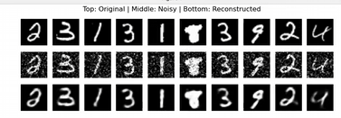

### The Denoising Autoencoder

The goal is to learn how autoencoder practically works and differs from the PCA analysis which was used in the previous machine learning course.

Notice that this py file requires a different venv to be run than the venv that worked for other due to pytorch version problem with transforms libary.

Super simply, the idea of this software is to receive input with noise, and reconstruct from it numbers without noise. Such as in the image below:

